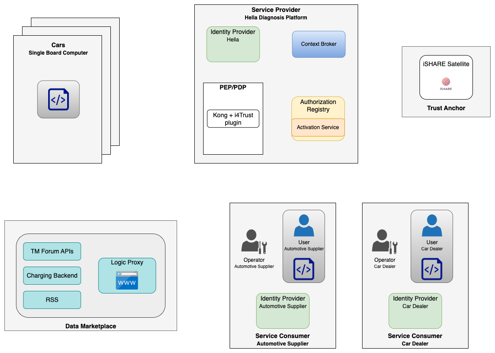
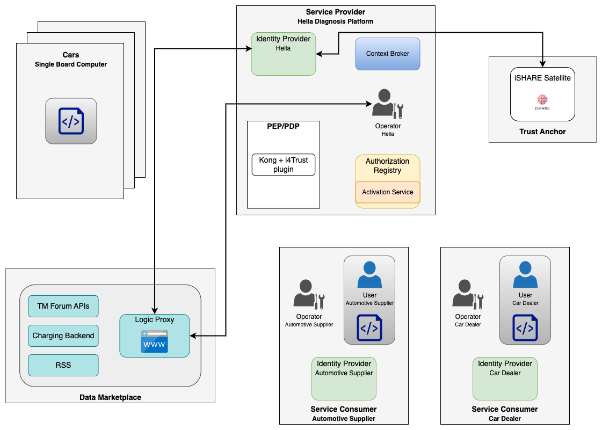

# AI-Marketplace data space demonstrator

App-of-apps for the marketplace

This fork extends the standard installation of the KI-Marktplatz data marketplace 
by components for the data sharing Proof-of-Concepts (PoCs).

> :bulb: This repository just provides a setup for temporary demonstration purposes. It is not recommended to be used in a production enviroment. Credentials are visible in clear text and are not encrypted. Installations should be deleted when demonstrations/presentations/etc. have finished. 

The GitHub actions of this repo are configured to deploy a full instance with all components 
required for this PoC, as soon as a branch is created. It is meant for a temporary deployment only. 
Note that the deployment should be deleted after 
each presentation/demo/etc., since there are only test accounts registered and credentials are visible in clear text in this 
repo.

Before moving this installation to a production environment, make sure to encrypt all credentials, keys, etc., e.g., 
using [sealed-secrets](https://github.com/bitnami-labs/sealed-secrets).

All scripts are developed for using an OpenShift Kubernetes cluster, but can be easily adapted for any 
kind of infrastructure.


## Deployment

It is required to setup two GitHub secrets in the 
repository ([also check this manual](https://github.com/FIWARE-Ops/marinera/blob/main/documentation/GITHUB_CI.md#openshift-service-account-permissions)):
* `OPENSHIFT_SERVER`: Server URL of the OpenShift cluster
* `OPENSHIFT_TOKEN`: Token from an OpenShift service account with sufficient permissions for creation/deletion of projects and applications, role assignments and deployments via Helm charts (e.g., with `cluster-admin` role) 

In order to deploy all components, simply create a branch which is named differently than `main`. 
The GitHub action will deploy all components to the namespace `kim-{BRANCH_NAME}`. 

Routes for externally exposed services are automatically created and hostnames are set dynamically. In order to 
retrieve the created hostnames, one can run, e.g., 
```shell
kubectl -n kim-{BRANCH_NAME} get routes
```
or check in the OpenShift console or in ArgoCD.

For the marketplace, when the branch was called `poc`, this might give you something like
```shell
NAME                                      HOST/PORT                                                                PATH   SERVICES                                PORT    TERMINATION     WILDCARD
marketplace-biz-ecosystem-logic-proxy-0   marketplace-biz-ecosystem-logic-proxy-0-kim-poc.apps.fiware.fiware.dev          marketplace-biz-ecosystem-logic-proxy   <all>   edge/Redirect   None
```
The marketplace logic proxy would be available under the URL: `https://marketplace-biz-ecosystem-logic-proxy-0-kim-poc.apps.fiware.fiware.dev`.


### Uninstall

For removing all components and deleting the applications and namespace, simply remove the branch.


## Credentials

Different accounts are created automatically with default passwords.

| Component     | Username               | Password          | Comment |
|---------------|------------------------|-------------------|---------|
| Keyrock Marketplace | admin@test.com | admin | Admin user of the marketplace |
| Keyrock Provider | admin@test.com | admin | Admin user of the Provider Keyrock IDP |
| Keyrock Provider | operator@provider.com | operator | Operator employee user of the Provider |
| Keyrock Automotive Supplier | admin@test.com | admin | Admin user of the Automotive Supplier Keyrock IDP |
| Keyrock Automotive Supplier | operator@autosupplier.com | operator | Operator employee user of Automotive Supplier |
| Keyrock Automotive Supplier | user@autosupplier.com | user | Standard user of Automotive Supplier |
| Keyrock Car Dealer | admin@test.com | admin | Admin user of the Car Dealer Keyrock IDP |
| Keyrock Car Dealer | operator@cardealer.com | operator | Operator employee user of Car Dealer |
| Keyrock Car Dealer | user@cardealer.com | user | Standard user of Car Dealer |

Root CA, keys and certificates have been created and self-signed using openssl. Keys and certificates used for this PoC 
can be found in the [certs folder](./certs). These should never be used in any kind of production enviroment or on a 
contineously running environment.  
Below table displays the assigned EORIs assigned to the different organisations and their keys/certificates:
| Organisation           | EORI                       |
|------------------------|----------------------------|
| Satellite              | EU.EORI.FIWARESATELLITE    |
| Marketplace            | EU.EORI.DEMARKETPLACE      |
| Hella                  | EU.EORI.DEHELLA            |
| Automotive Supplier    | EU.EORI.DEAUTOSUPPLIER     |
| Car Dealer             | EU.EORI.DECARDEALER        |


## Service endpoints

The Hella service provider offers endpoints to access data via the different data space types. 


### i4Trust

When using the i4Trust data space, the NGSI-LD endpoint is reacheable via the path `/diagnosis-i4trust/ngsi-ld/v1/entities`. 

Example call:
```shell
curl -X GET --header "Authorization <JWT>" https://hella-kong-kong-kim-poc.apps.fiware.fiware.dev/diagnosis-i4trust/ngsi-ld/v1/entities/<ENTITY-ID>
```
where `<JWT>` is a signed [iSHARE JWT](https://dev.ishareworks.org/introduction/jwt.html) access token issued by an IDP or by the service provider.

There is an example script [get_data_m2m_i4trust.py](./scripts/get_data_m2m_i4trust.py) which automatizes the process of obtaining an access token 
and retrieving diagnosis data at the Kong instance of the service provider. This should be run on behalf of the service consumer 
organisation after acquisition of the access rights. It will only work with the FIWARE Kubernetes cluster. Usage:
```shell
python scripts/get_data_m2m_i4trust.py <NAMESPACE> <PARTY>
```
where `<NAMESPACE>` denotes the mandatory parameter of the deployed namespace (e.g., `kim-{BRANCH_NAME}`) and 
`<PARTY>` is the optional parameter of the consuming party (default: `autosupplier`, other options: `cardealer`).


## Use case descriptions

The following gives a description of the steps to be performed for the data space use cases in the demonstrator.


### i4Trust

The i4Trust use case demonstrates data sharing within an i4Trust data space. This involves iSHARE specifications 
for the Identity and Access Management (IAM) as well as FIWARE Context Broker technology using NGSI-LD for the actual 
data exchange. 

The data marketplace allows service providers to offer their services in a plug&play mechanism.  
Service consumers can discover such offerings and acquire access to them. During the acquisition, the marketplace 
will automatically create the necessary access policies at the service provider's IAM infrastructure, so that the 
service consumer can directly start to access the service.

A very detailed description of all involved interactions and requests between the different components during creation 
of offering, acquisition of offerings and the actual service access, can be found in 
the [i4Trust Building Blocks documentation](https://github.com/i4Trust/building-blocks).


#### Architecture

The following diagram gives an overview of the involved organisations and components for the i4Trust use case.



* Data Marketplace  
The data marketplace is part of the KI-Marktplatz platform and is based on 
the [FIWARE Business API Ecosystem](https://business-api-ecosystem.readthedocs.io/en/latest/). It consists of different 
components for providing the necessary APIS, databases, business logic and user interface.

* Cars  
Cars are continiously sending data to the diagnosis platform for further data processing. This part will be simulated in 
this demonstrator.

* Service Provider - Hella Diagnosis Platform  
The diagnosis platform aggregates the car data in order to offer the diagnosis data using a context broker instance 
via the NGSI-LD API.  
The data service is protected by a Policy Enforcement Point (PEP) completed with a Policy Decision 
Point (PDP) following 
the [iSHARE specifications](https://ishareworks.atlassian.net/wiki/spaces/IS/pages/70222191/iSHARE+Scheme) for the 
service access. Both functionalities, PEP and PDP, 
are implemented using the [Kong API Gateway](https://docs.konghq.com/gateway/2.8.x/) and 
the [ngsi-ishare-policies](https://github.com/FIWARE/kong-plugins-fiware/tree/main/kong-plugin-ngsi-ishare-policies) Kong 
plugin.  
When evaluating the requested service access, the PDP will connect to an Authorization Registry following the iSHARE 
specifications and look up required access policies issued to the requesting organisation. The Authorization 
Registry is completed with an Activation Service, which allows the marketplace to create policies on behalf of the 
service provider.  
Users are registered within the Identity Provider (IDP) based on Keyrock. This allows users, e.g., an operator or 
administrative user of the service provider, to login at the marketplace and create offering on behalf of the 
service provider.

* Service Consumers - Automotive Supplier and Car Dealer  
The service consumer organisations, the automotive supplier and the car dealer, both operate own instances of 
IDPs, where their users are registered. This allows administrative users to login at the marketplace and acquire 
access to the service provider's offering on behalf of the service consumer organisation. After service acquisition, 
users can use scripts or applications for accessing the data service of the service provider.

* Trust Authority - iSHARE Satellite  
A trust authority is necessary within the data space in order to ensure trust among all data space 
participants/organisations and it is based on the iSHARE Satellite. The satellite is involved in all interactions 
between data space participants. When receiving requests, it allows organisations to verify the signature of the 
requesting participants and to ensure that these are trusted and active participants of the data space.


#### Create service offering

In order to publish the data service, the service provider first needs to create an offering on the marketplace. 
The following diagram gives an overview of this process.



1. An operator or administrative users visits the data marketplace and is offered different external IDPs that have 
   been registered at the marketplace. It selects the IDP of the service provider and is forwarded to its login page 
   for enetering the credentials. 
2. The IDP will verify against the satellite, whether the marketplace is a trusted 
   participant of the data space. 
3. When the login succeeded, the user is sent back to the landing page of the marketplace. The user now can create an 
   offering for the diagnosis service, providing all necessary information like the actual endpoint of the service, 
   the endpoint of the authorisation registry or the access rights that organisations will obtain when acquiring this 
   offering.
   
Per default, the offering is automatically created during deployment of this demonstrator. This can be switched off 
by setting this [parameter](https://github.com/FIWARE-AI-Marketplace/ai-marketplace/blob/066feb618a671f131c776b5c34f536e55266a963/applications/marketplace/values.yaml#L652) to `False` in the marketplace [values.yaml](./applications/marketplace/values.yaml) 
file.


#### Acquisition of service offering

